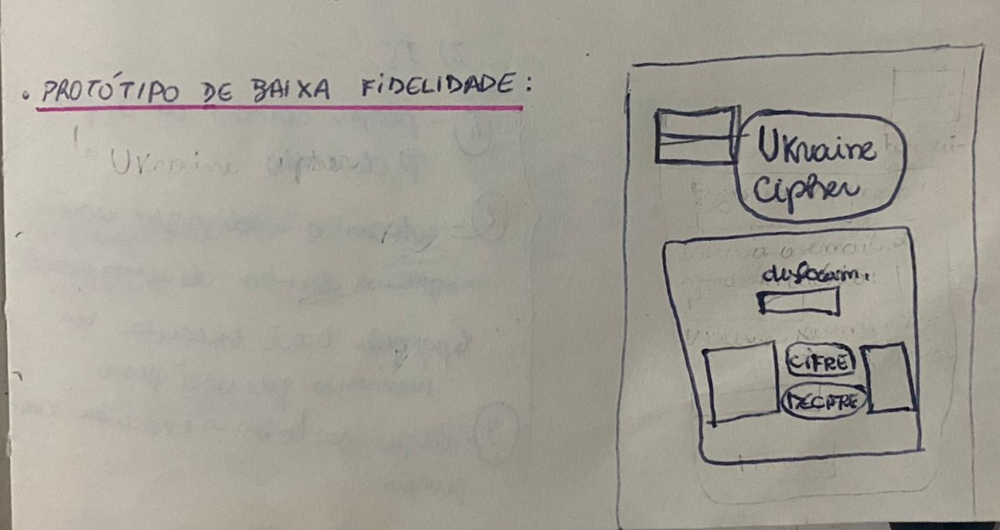
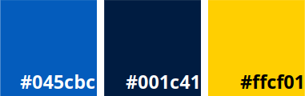

  # Ukraine Cipher
  
  

  
  
  
   
  
   
  
  **Status do Projeto:** _Concluído_ 

  Confira o resultado do projeto [aqui](https://amanda-holanda.github.io/SAP008-cipher/) 
  

## Índice

* [1. Resumo do projeto](#1-resumo-do-projeto)
* [2. Protótipo de baixa fidelidade](#2-protótipo-de-baixa-fidelidade)
* [3. Considerações técnicas](#3-considerações-técnicas)
* [3.1 Interface do usuário](#31-interface-do-usuário)
* [3.2 Organização dos arquivos](#32-organização-dos-arquivos)
* [3.3 Ferramentas utilizadas](#33-ferramentas-utilizadas)
* [3.4 Tech Skills](#34-tech-skills)
* [3.5 Objetivos de Aprendizagem](#35-objetivos-de-aprendizagem)

## 1. Resumo do projeto

O projeto Cifra de César foi o primeiro projeto desenvolvido no bootcamp da [Laboratoria](https://www.laboratoria.la/br). O seu principal objetivo era construir uma aplicação web (WebApp) que interagisse com o usuário final através do navegador utilizando HTML, CSS e JavaScript como ferramentas. Nela o usuário deve conseguir cifrar e decifrar um texto indicando a chave de deslocamento (offset), além de pensar em como deve ser a experiência do usuário (tela, explicações, mensagens, cores, marca?, etc.). A lógica do projeto teve como base o sistema de cifragem da Cifra de César.

A partir disso e com o tema inspirado na guerra da Ucrânia, desenvolveu-se o Ukraine Cipher: uma aplicação web de cifragem direcionada ao governo ucraniano com o objetivo de que os integrantes do governo consigam se comunicar de forma segura internamente e, dessa maneira, evitar que suas mensagens sejam compreendidas pelo Governo Russo e outros países inimigos. 

Logo, os principais usuários do produto são os integrantes do governo ucraniano e o principal objetivo do mesmo é proporcionar segurança na comunicação do governo num contexto de guerra.

Por fim, o website foi desenvolvido com sua paleta de cores inspirada nas cores da bandeira da Ucrânia e o seu nome “Ukraine Cipher” faz alusão a uma “Cifra da Ucrânia”.

## 2. Protótipo de baixa fidelidade

O desenvolvimento do projeto teve como base o protótipo de baixa fidelidade desenhado abaixo:

### Paleta de Cores:

## 3. Considerações técnicas

### 3.1 Interface do usuário

A interface do projeto foi idealizada com o objetivo de que o usuário:

- Escolha um número indicando quantas posições de deslocamento de caracteres a cifragem deve utilizar;
- Insira uma mensagem (texto) para ser cifrada;
- Consiga ver o resultado da mensagem cifrada ao apertar o botão de cifrar.
- Insira uma mensagem (texto) para ser decifrada;
- Consiga ver o resultado da mensagem decifrada ao apertar o botão decifrar.

### 3.2 Organização dos arquivos

A estruturação dos arquivos da aplicação web se dá da seguinte forma:

- index.html contém o código de estruturação da página web;
- style.css contém o código de estilização da página web;
- cipher.js contém a lógica do código para o mecanismo de cifragem e de decifragem;
- index.js contém a lógica do código de manipulação do DOM com interação do usuário na página.

### 3.3 Ferramentas utilizadas

* Visual Studio Code;
* Notion;
* Git;
* GitHub

### 3.4 Tech Skills

* HTML5;
* CSS3;
* JavaScript;
* Web APIs
* Metodologias Ágeis

### 3.5 Objetivos de Aprendizagem

#### HTML: 
* Uso de HTML semântico

#### CSS:
* Uso de seletores de CSS;
* Empregar o modelo de caixa (box model): borda, margem, preenchimento;

#### Web APIs
* Uso de seletores de DOM
* Manipulação de eventos de DOM
* Manipulação dinâmica de DOM

#### JavaScript
* Tipos de dados primitivos
* Strings (cadeias de caracteres)
* Variáveis (declaração, atribuição, escopo)
* Uso de condicionais (if-else)
* Uso de laços (for, for..of)
* Uso de funções (parâmetros, argumentos, valor de retorno)
* Testes unitários
* Módulos de ECMAScript (ES modules)
* Uso de linter (ESLINT)
* Uso de identificadores descritivos (Nomenclatura | Semântica)

#### Controle de Versões (Git e GitHub)

* Git: Instalação e configuração
* Git: Controle de versão com git (init, clone, add, commit, status, push, pull, remote)
* GitHub: Criação de contas e repositórios, configuração de chave SSH
* GitHub: Implantação com GitHub Pages

#### user-centricity

* Desenhar a aplicação pensando e entendendo a usuária

#### product-design

* Criar protótipos para obter feedback e iterar
* Aplicar os princípios de desenho visual (contraste, alinhamento, hierarquia)

